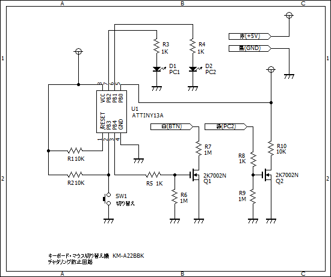

# Elecom KM-A22BBK チャタリング防止回路

Elecom KM-A22BBK マウス・キーボード切り替え機のボタンを好きなものに入れかえるため、
チャタリングを防止する回路とプログラムです。動作も安定します。

マイコンには、Atmel ATTiny13A を使用します。

PC2が有効のときに緑線に電圧が流れます。これを検知して2つのLEDを切り替えています。

切り替えボタンの白線に3.9Vかかっており、赤線の4.7Vとは大きく違うことから
切り替え機本体の電圧が違うと考えられるので、白線・緑線の間にはMOSFETを挟んでいます。

# 回路図

# 必要なツール

* [AVRISP2 MK2](http://www.microchip.com/developmenttools/productdetails.aspx?partno=atavrisp2)
* [CrossPack AVR](https://www.obdev.at/products/crosspack/index.html)

# ビルド

	$ make

# ヒューズビットの書込

	$ make fuse

# プログラムの書込

	$ make flash

